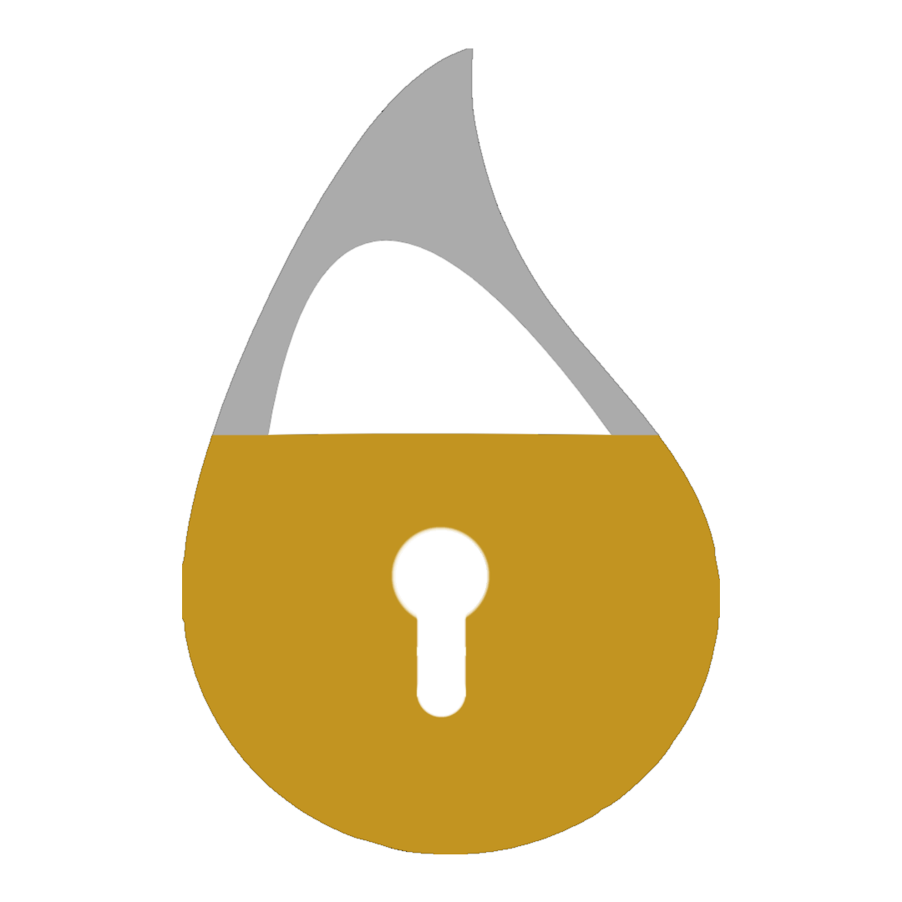

# Elixir Secure Coding Training (ESCT)

 

 

 

### An all-encompassing, opinionated cybersecurity curriculum designed for enterprise use at software companies using the [Elixir](https://elixir-lang.org/) programming language. 

[About](#about) |
[Curriculum](#curriculum) |
[Usage](#usage) |
[Contributing](#contributing) |
[License](#license)

## About
Originally developed for [Podium](https://www.podium.com)'s Elixir engineers by its Product Security team, the ESCT was designed to be integrated into developer onboarding processes - teaching developers about Application Security using context that applies to them. 

The content originally focused exclusively on what Podium uses, but quickly grew to encapsulate more areas of Application Security. The material itself is composed of views from the Product Security team at Podium as well as information sourced from reputable public information - attribution has been given wherever possible.

Today individuals or companies wishing to try out the ESCT can and are encouraged to fork a copy of their own - please follow the relevant instructions below depending on your use case.

If you find an issue, wish to suggest an idea, or start a discussion; please see our [CONTRIBUTING Guide](./CONTRIBUTING.md)!

## Curriculum
Currently the curriculum is broken into the follow 8 primary topics, each containing multiple lessons:
1. **OWASP**
    - OWASP Top 10
2. **Secure SDLC**
    - No Secrets In Code
    - Making Secret Rotation Easy
    - Rate Limiting
    - Principle of Least Privilege
3. **GraphQL Security**
    - Disabling Introspection
    - Error Disclosure
    - Resource Exhaustion
      - Cost Theory
4. **Elixir Security**
    - Atom Exhaustion
    - Protecting Sensitive Data
    - Untrusted Code
    - Timing Attacks
    - Boolean Coercion
5. **Cookie Security**
    - Ingredients of a Cookie
    - The Perfect Cookie
    - Elixir Phoenix Cookies
6. **Security Anti-Patterns**
    - Security Through Obscurity
    - Frontend Authorization Checks
7. **CI/CD Tooling**
    - Sobelow
      - Salus
    - Semgrep
8. **The Secure Road**
    - Service to Service Authentication
    - User Authorization

*If you do not see a topic or lesson you would like covered, please review our [open issues](https://github.com/podium/elixir-secure-coding/labels/new%20content) and our [CONTRIBUTING Guide](./CONTRIBUTING.md) before opening a new issue - but we encourage requests!*

## Usage
### For "Learners"
Using the ESCT as a consumer of the content is easy by just following these simple steps:
1. Fork this repo into a space you control
    - Important to note: if you were instructed to use this course by your company, double check with the folks who are running things for your company to ensure they don't have a customized version of the training materials
2. Clone your forked repo
3. Load the Live Markdown files in an instance of Livebook
    - For further instructions on getting Livebook setup locally, please refer to [their documentation](https://livebook.dev/#install).
4. Complete the training as instructed and save your progress along the way!
5. When you think you're finished, create a PR to ***your own fork*** of the training repo
    - You will receive feedback as to whether you completed it or not in the CI stage of your version control system*

*\*Feedback functionality only works in GitLab right now, GitHub support is [in the works](#)*

### For "Educators"
TODO

## Contributing
Please refer to our [CONTRIBUTING Guide](./CONTRIBUTING.md) for more details on how to add to this project!

## License

